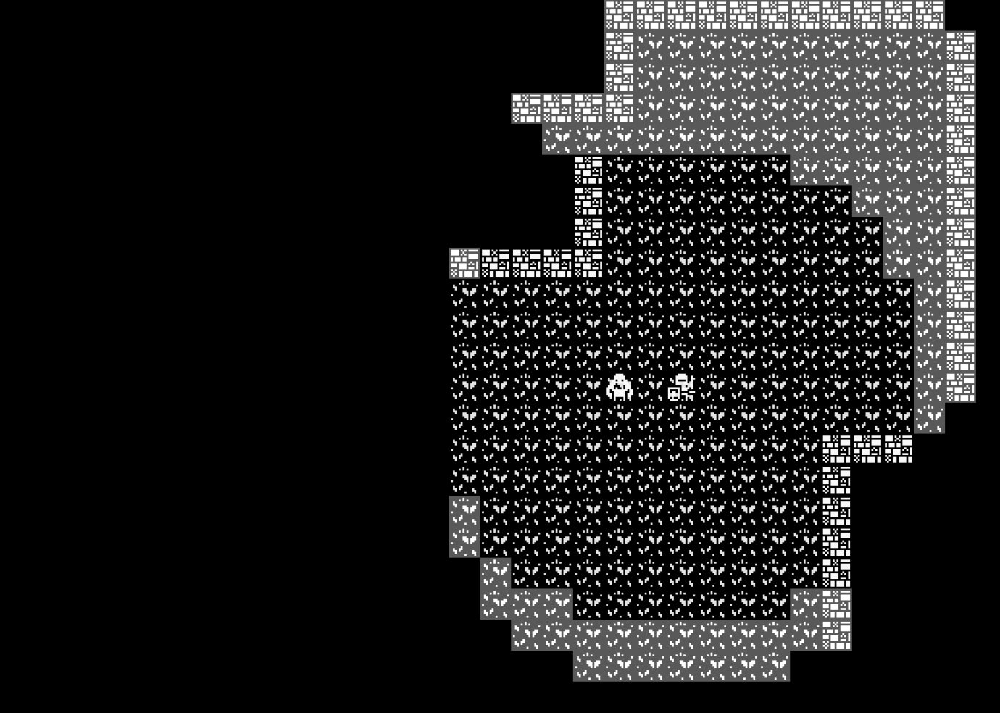

# Saga 🧙‍♂
A rogue like wrote in go.

Using game framework ebiten and web assembly!
## Run game with Web Assembly
### Build wasm file
```shell
GOOS=js GOARCH=wasm go build -o saga.wasm
```
### Import wasm_exec.js
```shell
cp "$(go env GOROOT)/misc/wasm/wasm_exec.js" .
```
### Run go server
```shell
$ go run server.go 
```
### Run the game!
Just visit ``localhost:8000``, and you'll see the game!

